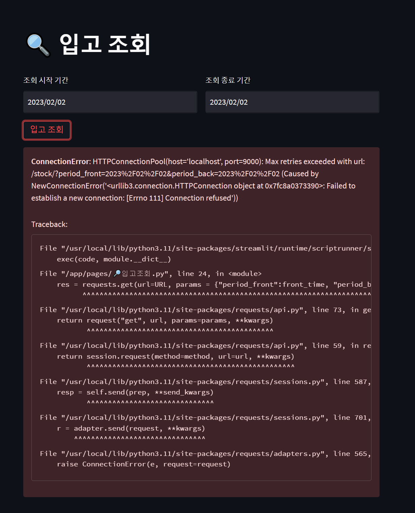

1. 현상
    1. Docker-compose를 통해 묶어 놓은 컨테이너들을 실행하던 중 python requests 라이브러리를 통해 POST, GET 요청 시 아래와 같은 오류 발생
    
    
    
2. 확인
    1. localhost, 127.0.0.1 등 주소 변환 후 재시도 시 같은 에러 발생
    2. 공유기 내부 포트포워딩을 통해 Host의 사설 아이피 9000포트를 허용 처리
        1. 이후 테스트 시 외부 IP를 통한 입력에서 반응 없음
        2. 포트의 허용/비허용과 관계 없이 GET, POST 요청에 반응이 없었음
    3. 윈도우 방화벽에서 컨테이너 포트 허용 
        1. Host 사설 IP 대역 + 포트 허용으로 GET, POST 요청을 받을 수 있었음
            1. cmd + ipconfig 를 통해 알아낸 사설 IP
        2. 이후 포트와 관련된 오류인지 확인하고 싶어 비허용 처리 후 확인 시 이전과 같은 오류가 나타나는 것을 확인
3. 처리 방법
    1. [localhost](http://localhost) → Host의 사설 IP로 교체
    2. 윈도우 방화벽에서 9000번 포트 허용

---

requests 라이브러리로 요청을 보낸 경우 [localhost](http://localhost), 127.0.0.1 처럼 루프백 주소가 아닌 정확한 IP를 넣어줘야 요청을 반환해주었다.

루프백 

- 자신의 컴퓨터를 스스로 서버로 만들고 그 컴퓨터에서 콜을 보내 응답을 받을 수 있는 것
- 내 컴퓨터가 내 컴퓨터에 응답을 보내고 받는 기능이기 때문에, DNS 서버를 통해 ip주소로 변환할 수 있는 기능이 없다.

출처- [https://velog.io/@lky9303/127.0.0.1-과-localhost의-차이](https://velog.io/@lky9303/127.0.0.1-%EA%B3%BC-localhost%EC%9D%98-%EC%B0%A8%EC%9D%B4)