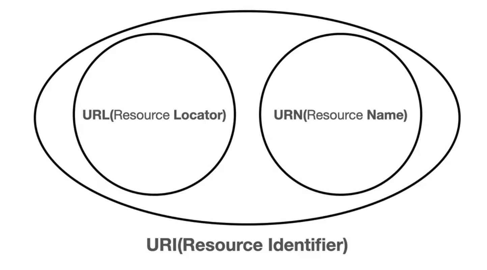
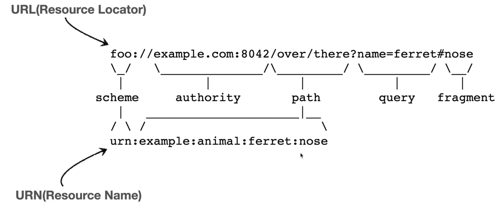
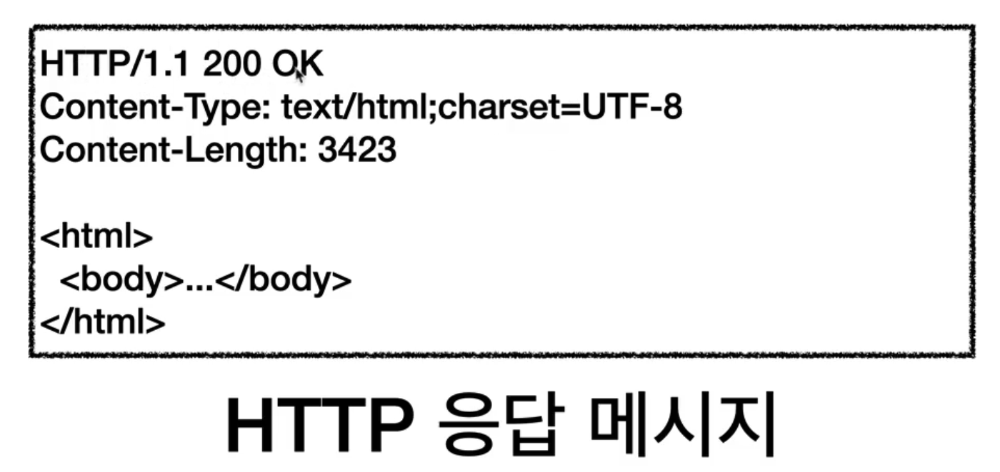
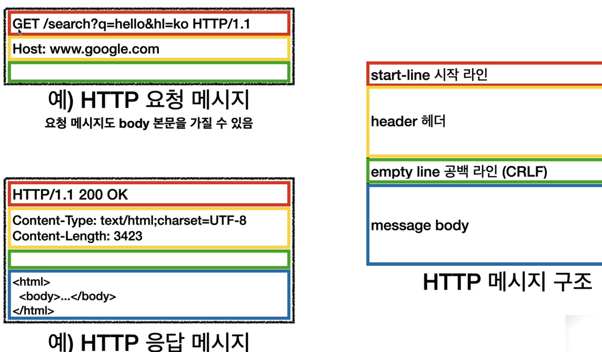

## HTTP(Hypertext Transfer Protocol)

클라이언트와 서버 간 통신을 위한 통신 프로토콜

## HTTPS(Hypertext Transfer Protocol Secure)

브라우저와 서버가 데이터를 전송하기 전에 암호화된 연결 지원

## 인터넷 네트워크

### IP(Internet Protocol)

지정한 IP 주소에 데이터 전달

패킷이라는 통신 단위로 데이터 전달

- 큰 용량의 데이터인 경우 1,500 바이트를 기준으로 데이터를 잘라 전달(1회당 전송 가능 용량 약 1,500byte)
- IP 패킷 정보
    - 출발지IP, 목적지IP, 기타, 전송데이터로 구성
- 클라이언트 → 서버로 보낸 패킷이 갔던 경로와 서버 → 클라이언트로 보낸 응답의 경로가 다를 수 있음
- IP 프로토콜의 한계
    - 비연결성 : 받는 대상 유무에 관계 없이 일단 전송
    - 비신뢰성 : 패킷이 중간에 유실되거나 패킷이 순서대로 도착하지 않을 수 있음
    - 프로그램 구분 : 같은 IP를 사용하는 서버에서 앱을 2가지 이상 사용할 경우 어떻게 구분 하는지?

### TCP / UDP

- 인터넷 프로토콜 스택 4계층
    1. 애플리케이션 - HTTP, FTP
        1. 프로그램에서 서버로 보내고 싶은 데이터를 SOCKET 라이브러리를 통해 전달
    2. 전송 - TCP, UDP
        1. 1-a에서 발생한 데이터에 TCP 정보를 생성해 포함 시킨다.
        2. TCP 세그먼트 정보 - 출발지 PORT, 목적지 PORT, 전송제어, 순서, 검증 정보 등
    3. 인터넷 - IP
        1. 2-a에서 발생한 데이터에 IP 패킷을 생성해 포함 시킨다.
    4. 네트워크 인터페이스
        1. 네트워크와 관련된 물리적인 정보(Mac address 등)를 3-a의 데이터에 추가해 서버로 전달
        
- TCP(Transmission Control Protocol) 특징
    - 연결 지향
        - TCP 3 way handshake(가상연결) - SYN : Synchronization(연결), ACK : Acknowlegement(승인)
            1. SYN : 클라이언트가 서버에 접속 요청
            2. SYN + ACK : 서버가 접속을 승인하고 클라이언트에 접속 요청
            3. ACK : 클라이언트가 접속 승인
            4. 3.ACK 가 진행될 때 데이터를 같이 전송
            5. 논리**적인 연결이며 실제 연결이 된 것은 아님**
        - IP 패킷과 다르게 받는 대상이 연결된 것을 먼저 확인 후 통신
    - 데이터 전달 보증
        - 데이터를 전송에 대한 결과를 서버가 클라이언트로 보내준다.
    - 순서 보장
        - 클라이언트에서 보낸 패킷 1,2,3이 순서대로 서버에 도착하지 않은 경우 서버에서 클라이언트로 패킷 순서 보장을 요청한다.
    - 신뢰 가능한 프로토콜
    
- UDP(User Datagram Protocol) 특징
    - TCP와 비교하면 기능이 거의 없음
    - 데이터 전달 및 순서가 보장되지 않지만 단순하고 빠름
        - TCP는 안정적이지만 느리기 때문에 UDP는 빠르지만 불안정
    - IP와 거의 같으며 PORT, CHECKSUM 정도만 추가
    - 애플리케이션에서 추가 작업 필요
        - TCP는 이미 완성되어져 있는 것에 가깝기 때문에 최적화를 위해 시도하려면 UDP에 애플리케이션 레벨에서 무언가 만들어서 작업하는 것이 바람직
    - 최근에는 HTTP 3을 사용하면서 최적화를 위해 UDP가 각광 받는 추세

### PORT

같은 IP에서 여러 어플리케이션을 구동 시키기 위해 PORT 값을 추가해 구분 프로세스를 구분한다.

- TCP / UDP 를 사용하는 전송 계층을 지날 때 출발지와 도착지의 PORT가 같이 추가된다.
- PORT 활용 팁
    - 0 ~ 65535 사이로 PORT 번호를 할당 할 수 있으나 0 ~ 1023 사이는 잘 알려진 포트로 사용을 권장하지 않는다.
        - FTP - 20, 21
        - TELNET - 23
        - HTTP - 80
        - HTTPS - 443

### DNS(Domain Name System)

도메인 이름을 IP 주소로 변환

- IP는 변경될 수 있기 때문에 DNS를 고정으로 사용하고 연결 되어 있는 IP를 변경 하는 방식으로 사용
- DNS 접속 시나리오
    1. 클라이언트 → [google.co.kr](http://google.co.kr) 접속
    2. [google.co.kr](http://google.co.kr) 이 가진 IP를 DNS서버가 반환
    3. 클라이언트 → 2에서 반환 받은 IP로 통신

## URI와 웹 브라우저 요청 흐름

### URI(Uniform Resource Identifier)

Uniform : 리소스를 식별하는 통일된 방식

Resource : 자원, URI로 식별할 수 있는 모든 것

Identifier : 다른 항목과 구분하는데 필요한 정보

- URI, URL, URN 의 구분
    
    
    
    - URL - Resource의 위치
    - URN - Resource의 이름
    - URI - Resource 식별자
- URL과 URN의 형태
    
    
    

- URN 이름만으로 실제 리소스를 찾는 방법이 보편화 되지 않아서 URI = URL과 같은 의미로 자주 사용된다.
- URL 전체 문법
    - ```http
        scheme://[userinfo@]host[:port][/path][?query][#fragment] - []안은 생략 가능
      ```
    - https://www.google.com:443/search?q=hello&hl=ko
    - 프로토콜 : https
    - 호스트 : www.google.com
    - 포트 : 443 (=https 연결이기 때문에 사용됐으며 http(80)과 https(443)은 보통 생략한다.)
    - 경로 : /search (계층적 구조)
    - 쿼리 : q=hello&hk=ko
        - Key = Value 형태
        - ? 로 시작. &으로 추가
        - query parameter, query string등으로 불린다.(모두 문자 형태)
    - 프래그먼트 : html 내부 북마크 등에 사용하며, 서버에 전송되는 정보는 아니다.
    - host 앞의 유저 정보는 URL에 사용자정보를 포함해 인증하는 경우로 거의 사용 되지 않는다.

### 웹 브라우저 요청 흐름

[https://www.google.com:4](https://www.google.com:443)43/search?q=hello&hl=ko 를 입력했을 때 프로세스

1. DNS를 조회 해 IP와 PORT 번호를 찾는다.
2. HTTP 요청 메시지 생성
    1. GET /search?q=hello&hl=ko HTTP/1.1
        1. path와 쿼리 정보 + HTTP 버전 정보
    2. Host : www.google.com
3. SOCKET 라이브러리를 통해 전달
    1. TCP / IP 연결 ( IP, PORT)
    2. 데이터 전달
4. TCP / IP 패킷 생성, HTTP 메시지 포함
5. 네트워크 인터페이스(LAN 드라이버, LAN 장비)를 통해 인터넷에 전송
6. 인터넷 노드를 통해 구글 서버에 요청 패킷 도착
7. 구글 서버는 TCP / IP 패킷을 버리고 안의 HTTP 요청 메시지를 확인 후 HTTP 응답 메시지를 작성
    
    
    
8. 구글 서버에서 응답 패킷을 만들어 클라이언트로 다시 리턴
9.  클라이언트 또한 TCP / IP 패킷 내부의 HTTP 응답 메시지를 읽어 웹 브라우저가 HTML 랜더링을 통해 화면  출력

## HTTP(Hyper Text Transfer Protocol) 기본

### HTTP로 거의 모든 형태의 데이터를 전송 가능

- HTML, TEXT, IMAGE, 음성, 영상, 파일, JSON, XML 등
- 서버간 데이터를 주고 받을 때도 대부분 HTTP 사용

### HTTP의 역사

- HTTP/0.9 (1991년) : GET 메서드만 지원, HTTP 헤더 X
- HTTP/1.0 (1996년) : 메서드, 헤더 추가
- HTTP/1.1 (1997년)
    - 대부분의 기능들이 1.1에 구현이 되어 있어 2나 3이 있음에도 현재 1.1을 가장 많이 사용
    - 버전
        - RFC2068(1997)
        - RFC2616(1999)
        - RFC7230 ~ 7235(2014) - 현재
- HTTP/2 (2015년) : 성능 개선
- HTTP/3 (~진행 중) : TCP 대신 UDP를 사용하며, 성능 개선

### 기반 프로토콜

- TCP : HTTP/1.1, HTTP/2
- UDP : HTTP/3
    - TCP는 3-way-handshake나 기본적인 데이터의 용량도 크기 때문에 속도가 낮다.
    - UDP의 어플리케이션 레벨에서 성능 최적화를 위해 설계한 해 나온 것이 HTTP/3이다.
- 현재 HTTP/1.1을 주로 사용하지만 HTTP2. 3도 점점 사용 증가 추세
- 페이지에서 어떤 HTTP 프로토콜을 사용해 통신하는지 알고 싶은 경우 웹 페이지의 개발자 모드에 진입해서 Protocol 탭을 활성화 하면 작업들이 어떤 HTTP 버전을 사용했는지 알 수 있다.
    - http/1.1 = HTTP/1.1
    - h2 = HTTP/2

### 클라이언트 - 서버 구조

- Request - Response 구조
- 클라이언트는 서버에 요청을 보내고, 응답 대기
- 서버가 요청에 대한 결과를 만들어 응답

### 무상태 프로토콜(Stateless)

- 서버가 클라이언트의 상태를 보존하지 않는다.
    - 예로 클라이언트의 1,2,3 연속적인 요청이 있어도 서버는 1,2,3의 요청이 연속적인지 알지 못하고 개별적으로 처리한다.
- 장단점
    - 장점 : 서버 확장성 높음(Scale out)
    - 단점 : 클라이언트가 추가 데이터 전송
- 한계점
    - 로그인 시 로그인한 사용자의 상태를 서버에 유지해야 함
        - 일반적으로 브라우저 쿠키와 서버 세션을 사용해 상태를 유지하며 최소한만 사용한다.
        

### 비연결성

- TCP/IP 연결을 통해 클라이언트-서버에 연결할 때 연결을 계속 유지 시키면 서버와 통신하는 클라이언트의 개수만큼 서버의 자원을 지속적으로 사용하게 된다.
- 클라이언트의 요청에 서버의 응답이 처리되면 연결을 끊음으로써 서버의 자원을 효율적으로 사용할 수 있다.
- HTTP는 기본적으로 연결을 유지하지 않는 모델
- 한계점
    - TCP/IP 연결을 새로 맺어야 하기 때문에 3-way-handshake 시간이 추가 된다.
    - 웹 브라우저로 사이트를 요청하면 HTML, Javascript, css, 이미지 등 많은 자원이 함께 다운로드
    - 현재는 HTTP 지속 연결(Persistent Connections)로 문제 해결
        - 초기에 연결 1회를 진행한 후 요청 할 내용을 몰아서 서버로 보낸 뒤 모든 응답을 받으면 종료하는 프로세스로 진행
- 비연결성 때문에 서버 개발자들이 어려워하는 업무
    - 같은 시간대에 발생하는 대용량 트래픽
        - 선착순 이벤트, 명절 KTX 예약, 수강신청, 콘서트 예매 등
- 최대한 비연결성을 고려해 프로세스를 짜야 나중에 발생할 수 있는 대용량 트래픽 상황에서 Scale out 방식으로 서버를 늘려 대응할 수 있는 기회를 만들 수 있음

### HTTP 메시지

- HTTP 메시지의 구조
    
    
    
    - Start line
        - request-line
            - method SP(=공백) request-target(=abs path) SP HTTP-version CRLF(=엔터)
        - status-line
            - HTTP-version SP status-code SP reason-phrase CRLF
    - header
        - HTTP 전송에 필요한 모든 부가정보
            - 메시지 바디 내용, 크기, 압축, 인증, 요청 클라이언트(브라우저) 정보, 서버 애플리케이션 정보, 캐시 등
        - field-name “:” OWS(=띄어쓰기 허용) field-value OWS
        - field-name은 대소문자 구분이 없지만 value는 대소문자 구분을 한다.
    - empty line
    - message body
        - 실제 전송할 데이터
        - HTML 문서, 이미지, 영상, JSON 등 byte로 표현할 수 있는 모든 데이터
    

## HTTP 메서드

- API 설계 시 리소스 식별을 가장 중요하게 생각하고 설계해야 한다.
- URI는 리소스(명사)만 식별하고 method(동사)로 행위를 구분
- HTTP 메서드 종류
    - GET(=READ) : 리소스 조회
    - POST(=CREATE) : 요청 데이터 처리, 주로 등록에 사용
    - PUT(=UPDATE) : 리소스를 대체, 리소스가 존재하지 않으면 생성
    - DELETE(=DELETE) : 리소스 삭제
    - PATCH : 리소스 부분 변경
    - HEAD : GET과 비슷하나 메시지 부분을 제외하고 상태 줄과 헤더만 반환
    - OPTIONS : 대상 리소스에 대한 통신 가능 옵션(메서드)을 설명(주로 CORS에서 사용)
    - CONNECT : 대상 자원으로 식별되는 서버에 대한 터널을 설정
    - TRACE : 대상 리소스에 대한 경로를 따라 메시지 루프백 테스트 수행
- HTTP 메서드 상세
    - GET
        - 리소스 조회
        - 서버에 전달하고 싶은 데이터를 query를 통해 전달
        - 메시지 바디에 데이터를 전달할 수 있지만 지원하는 곳이 한정적이기 때문이 권장하지 않음
    - POST
        - 요청 데이터 처리
            - 단순히 데이터의 생성, 변경을 넘어 프로세스 처리를 해야 하는 경우
            - POST의 결과로 새로운 리소스가 생성 되지 않을 수 있음
            - 리소스만으로 URI 설계가 되지 않기 때문에 프로세스의 상태 변경을 컨트롤 URI 를 이용해 할 수 있음
            - 예 : POST /orders/orderid/start-delivery (컨트롤 URI)
            - 다른 메서드로 처리하기 애매한 경우
            - 모든 동작을 POST로 할 수 있지만 가급적 상황에 맞는 메서드를 사용한다.
        - 메시지 바디를 통해 서버로 요청 데이터 전달
        - 메시지 바디를 통해 들어온 데이터를 처리하는 모든 기능 수행
        - 주로 전달된 데이터로 신규 리소스 등록, 프로세스 처리에 사용
    - PUT
        - 리소스를 대체(완전 대체)
            - 리소스가 있으면 대체, 없으면 생성
            - 덮어쓰기의 개념
            - 리소스에 나이, 이름이 있지만 나이만 넣은 경우 기존의 이름은 사라지고 나이만으로 대체된다.
        - **클라이언트가 리소스를 식별**
            - 클라이언트가 리소스의 위치를 이미 알고 있는 상태로 URI 지정
            - POST와의 차이는 리소스의 식별 유무
    - PATCH
        - PUT이 리소스를 완전 대체하기 때문에 기존 인자에 맞지 않게 값을 주는 경우 기존의 값이 무시되는 문제를 방지하기 위해 PATCH를 사용한다.
        - PATCH로 리소스를 수정하게 되면 명시한 부분만 변경되기 때문에 리소스의 대체가 한결 수월해진다.
        - 간혹 PATCH를 지원하지 않는 서버에는 POST를 이용해 리소스를 변경하기도 한다.
    - DELETE
        - 리소스를 삭제할 때 사용
- HTTP 메서드 속성
    - 안전
        - 호출해도 리소스에 변경이 없다.
    - 멱등
        - 한번 호출하든 두 번 호출하든 n번 호출해도 결과가 똑같다.
        - 서버가 TIMEOUT 등으로 정상 응답을 주지 못한 경우 클라이언트가 같은 요청을 해도 같은 값을 기대해도 되는 것인가? 가 판단의 근거가 될 수 있다.
        - 외부 요인으로 중간에 리소스가 변경되는 것 까지는 고려하지 않는다.
    - 캐시 가능
        - 응답 결과 리소스를 캐시해서 사용하도 되는가?
        - GET, HEAD, POST, PATCH 는 캐시 사용 가능
        - 실제 GET, HEAD 정도만 캐시로 사용
            - POST, PATCH는 본문 내용까지 캐시 키로 고려해야 하나, 구현이 쉽지 않음

## Client → Server 데이터 전송

데이터 전달 방식

1. 쿼리 파라미터를 통한 데이터 전송
    1. GET
    2. 주로 정렬 필터(검색어)
2. 메시지 바디를 통한 데이터 전송
    1. POST, PUT, PATCH
    2. 회원 가입, 상품 주문, 리소스 등록, 리소스 변경
3. HTML Form 전송은 GET, POST만 지원

C(lient)S(erver) 데이터 전송 상황

1. 정적 데이터 조회
    1. 이미지, 정적 텍스트 문서
2. 동적 데이터 조회
    1. 검색, 게시판 목록에서 정렬 필터(검색어)
3. HTML Form을 통한 데이터 전송
    1. 회원 가입, 상품 주문, 데이터 변경
4. HTTP API를 통한 데이터 전송
    1. 회원 가입, 상품 주문, 데이터 변경
    2. 서버 to 서버, 앱 클라이언트, 웹 클라이언트(Ajax)

---

출처

[모든 개발자를 위한 HTTP 웹 기본 지식 - 인프런 | 강의](https://www.inflearn.com/course/http-웹-네트워크/dashboard)