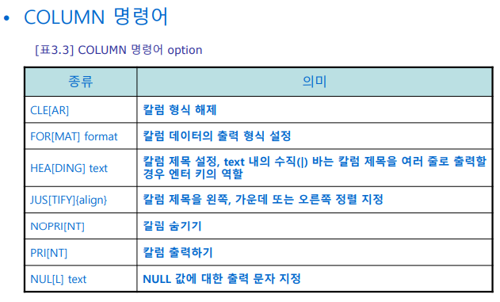
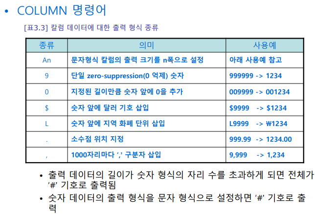
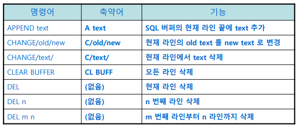
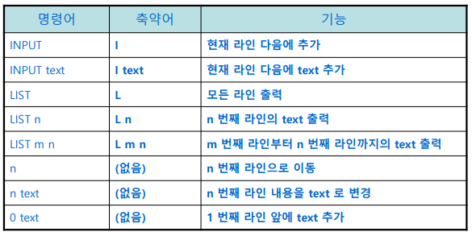
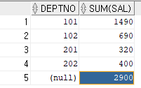
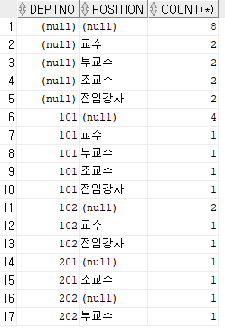

## Docker Oracle 설치

```bash
docker pull jaspeen/oracle-xe-11g # 도커 이미지 다운로드

# 도커 컨테이너 생성
docker run -d --name oracle -p 1521:1521 \
-v C:/oracle:/u01/app/oracle jaspeen/oracle-xe-11g

# 오라클 실행
docker exec -it oracle sqlplus # 초기 ID : system // PW: oracle // SID : xe

# Tablespace 생성
CREATE tablespace SAMPLE_DATA datafile '/u01/app/oracle/tablespace/sample_data.dbf' size 300m reuse autoextend on next 1024k maxsize unlimited;

```

[Docker로 Oracle DB사용하기](https://velog.io/@hoplin/Docker로-Oracle-DB사용하기)

## SQL PLUS 유용한 팁

[[Oracle] sqlplus 화면 지우기 clear - 유저 확인, 오라클 버전 확인](https://withthisclue.tistory.com/entry/Oracle-sqlplus-화면-지우기-clear-유저-확인-오라클-버전-확인)

## Oracle DB에 .sql 파일 실행하기

- 도커에 연결된 host의 파일 위치에 .sql 파일을 위치 시킨 뒤 sqlplus에서 아래와 같이 @@경로 입력을 하면 sql파일을 풀 수 있다.
    
    ```sql
    @@/u01/app/oracle/SQL파일.sql 
    ```
    

## SQL 샘플테이블 실습

- 실습에 자주 사용되는 Employees 테이블의 경우 hr계정으로 주로 진행되는데 해당 계정은 이미 생성되어 있고 잠겨있기 때문에 아래와 같은 lock 해제가 필요하다.
- SQL의 경우 대체적으로 대소문자를 구분하지 않지만 비밀번호는 예외적으로 대소문자 구분을 한다.
    
    [[Oracle] HR 계정 Lock 해제 및 비밀번호 변경 [SQL Developer HR 계정 설정 변경]](https://yermi.tistory.com/entry/Oracle-HR-계정-Lock-해제-및-비밀번호-변경-SQL-Developer-HR-계정-설정-변경)
    
    [sql 파일 oracle로 입력하기(사용자 생성하기)](https://nhs0912.tistory.com/32)
    
- Employees 샘플 스키마 생성(*21c버전 테스트 성공*)
    
    [오라클(ORACLE) 샘플 스키마 설치](https://bkjo94.tistory.com/entry/오라클ORACLE-샘플-스키마-설치)
    
    [Database Sample Schemas](https://docs.oracle.com/en/database/oracle/oracle-database/23/comsc/installing-sample-schemas.html#GUID-1E645D09-F91F-4BA6-A286-57C5EC66321D)
    
    [새로운 계정을 만들어 테이블 만들어보기](https://yjy0755.tistory.com/22)
    

## 기본 환경

- 실습 환경 : Oracle 11g Express Edition
- DBMS - DB 생성 및 구조 설정, 조회, 수정을 가능하게 하며 권한에 따른 보안 제공
- Oracle - 관계형으로 시작해 객체지향(ORDB)으로 변형
- Oracle DB 계정 명칭
    - Super 계정
        - sys - 주로 콘솔에서 사용
        - system - 주로 외부에서 사용
    - 일반 계정 - hr, scott
- 콘솔 접속 명령어 - conn as sysdba
- 계정 확인 명령어 - show user
- 실습
- **명령어**
    - scott 계정 실행
        - @C:\oraclexe\app\oracle\product\11.2.0\server\rdbms\admin\scott.sql
        - @ 는 주로 실행(Run)의 의미를 갖는다.
    - scott 계정의 비밀번호 변경
        - alter user scott identified by tiger;
        - identified by 는 패스워드 설정 명령어
    - scott 접속
        - connect scott
            - 별도 패스워드 입력 필요
        - connect scott/tiger
            - 패스워드 입력 불필요하나 화면에 노출
    - admin 접속
        - conn sys as sysdba

## SQL 명령문 종류

- 질의어 - DQL(Data Query Language)
    - SELECT
- 데이터 조작어 - DML (Data Manipulation Language)
    - INSERT
    - UPDATE
    - DELETE
- 데이터 정의어 - DDL (Data Definition Language)
    - CREATE
    - ALTER
    - DROP
    - RENAME
    - TRUNCATE
- 트랜잭션 처리어 - TCT (Transaction Control Language)
    - COMMIT
    - ROLLBACK
    - SAVEPOINT
- 데이터 제어어 - DCL (Data Control Language)
    - GRANT(권한 부여)
    - REVOKE(권한 철회)
- DML, DDL 로 같은 결과가 예상되면 DDL로 작업하는 것이 더 좋다.
- 테이블 인스턴스
    - DB 설계 시 테이블의 구조와 칼럼의 특성을 요약한 내용
- DB에 있는 테이블 확인 하는 방법
    - SELECT * FROM tab;
    

## 데이터 타입

- CHAR
    - 고정 길이 문자열 저장
    - 최대 2,000 바이트
    - 주민번호 처럼 길이가 일정한 경우 사용 권장
    - 주소 공간의 낭비가 심할 수 있음
    - VARCHAR2
        - 가변 길이 문자열 저장
        - 최대 4,000 바이트
        - 지정된 길이 보다 짧은 경우 뒤는 NULL 처리해 저장공간 낭비를 막을 수 있음
        - 입력된 데이터의 편차가 심한 경우 사용 권장
- NUMBER
    - NUMBER(precision, scale) 형식으로 입력
        - precision - 소수점을 포함하는 전체 자리수
        - scale - 소수점 이하 자리수
- DATE
    - 세기, 년도, 월, 일, 시간, 분, 초의 날짜와 시간을 저장
    - 7비트의 고정 길이
    - 퍼스널 오라클의 기본 날짜 형식 - YY/MM/DD
- LOB
    - 텍스트, 그래픽, 이미지, 동영상, 사운드와 같은 비구조형 대용량 텍스트 혹은 멀티미디어 데이터를 저장하기 위한 데이터 타입
    - 최대 4GB
    - BLOB
        - 그래픽 이미지, 동영상, 사운드와 같은 바이너리 데이터 저장
    - CLOB
        - e-book, html과 같은 대용량 텍스트 데이터 저장
    - NCLOB
        - 국가별 문자셋(유니코드) 데이터 저장
    - BFILE
        - 바이너리 데이터를 저장하나 읽기 전용으로 내용 변경 불가
- ROWID
    - 테이블에서 행의 위치를 지정하는 논리적 주소 값
    - 테이블에 행이 삽입되면 자동으로 생성
    - 조회(SELECT)는 가능하나 입력(INSERT), 수정(UPDATE) 등의 DML 문으로 변경 불가
- Pseudo-column
    - 변경 불가능한 조회만 가능한 참조형 데이터타입
    - CURRVAL, NEXTVAl, LEVEL, ROWNUM 이 있음
    - 실제 유용하게 사용
- TIMESTAMP
    - TIMESTAMP WITH TIME ZONE
        - TIMESTAMP 데이터 타입에 지역시간대를 저장
        - 세계 표준시간을 기준으로 현 지역 시간대를 환산
    - TIMESTAMP WITH LOCAL TIME ZONE
        - TIMESTAMP 데이터 타입에 사용자 데이터베이스의 지역시간대를 저장
- DUAL
    - 오라클이 생성될 때 자동 생성되며 모든 사용자들이 접근 가능한 테이블
    - sys 계정이 소유
    - 상수값, 의사열, 표현식 등의 값을 단 한번만 돌리거나 현재 날짜, 시각을 알고자 할 때 일시적으로 사용하기 위해 사용
    - 테이블 내 dummy 컬럼 하나만 존재한다.

- 조건절 검색
    - ESCAPE - LIKE 연산자 사용 중 특정 단어를 회피하기 위함
        
        ```sql
        SELECT * FROM student WHERE name like '황보\_%' escape '\';
        ```
        
- NULL
    - 아직 정의되지 않는 값 ( 0이 아님 )
    - 대부분 집계(Aggregation) 함수는 null을 자동으로 무시하고 계산
    - NVL
        - 데이터가 NULL 인 경우 데이터를 대체해주는 함수
        - NVL
            - 대상의 값이 NULL일 때 대체
        - NVL2
            - 대상의 값이 NULL, NOT NULL 에 따라 각각 맞는 값을 대체
            
- 집합 연산자
    - 집합 연산을 사용 할 수 없는 경우
        - 컬럼 수가 동일하지 않은 경우
        - 컬럼의 데이터 타입이 다른 경우
    - UNION - 중복제거된 합집합
    - UNION ALL - 중복되는 행까지 포함한 합집합
    - MINUS - 차집합
    - INTERSECT - 교집합
    

## SQL *PLUS

- Oracle DB 설치 시 같이 설치되는 CLI 프로그램
- Run SQL Command Line.exe
- 명령어
    - SET HEADING OFF[ON] - 테이블 조회 시 컬럼명을 숨김/공개
    - ED - 메모장이 열리며 기존 메모리에 남아있는 명령어를 수정할 수 있게 되며 수정이 끝나면 메모장을 닫으면 커맨드 창에 명령어가 남게 된다.
    - COMMIT - DML ( UPDATE, INSERT, DELETE ) 처리 후 커밋을 하지 않으면 디스크에 실행된 내용이 저장되지 않는다.
    - AUTOCOMMIT- DML 명령문 실행 후 자동 COMMIT 하도록 작성하는 명령어
    
    ```sql
    -- [ off | on | imm[ediate] | n ]
    autocommit ON
    ```
    
    - FEED[BACK] - SELECT 명령문의 표현 범위를 설정
    
    ```sql
    -- [ 6 | n | off | on ]
    show feedback
    set feedback 10 
    ```
    
    - LINESIZE - 한 화면에 표시되는 SQL 명령문의 출력 결과에 대한 행 크기 설정
    
    ```sql
    -- LIN[ESIZE] { 80 | n }
    set linesize 100
    ```
    
    - PAGESIZE - 한 화면에 표시되는 SQL 명령문의 출력 결과에 대한 페이지 크기 변경
    
    ```sql
    -- PAGES[IZE] { 14 | n }
    set pages 20
    ```
    
    - PAUSE - SQL 명령문을 한 화면으로 보기 힘든 경우 한 페이지씩 나눠 볼 때 사용하며 ENTER를 입력하면 다음으로 넘어감
    
    ```sql
    -- PAUSE { ON | OFF }
    set pause on
    ```
    
    - TERMOUT - SQL 명령문 실행 결과의 화면 출력 여부를 지정
    
    ```sql
    -- TERM[OUT] { ON | OFF }
    set termout off
    @ termout -- 출력 결과가 화면에 나타나지 않음
    ```
    
    - TIME - 프롬프트 앞에 현재 시간 표시
    
    ```sql
    -- TI[ME] { ON | OFF }
    set time on
    ```
    
    - TIMING - SQL 명령문의 실행 시간을 표현
    
    ```sql
    -- TIMING { ON | OFF }
    set timing on
    ```
    

- **형식 명령어**
    - SQL 명령문의 실행 결과에 대한 컬렴명이나 데이터 출력 형식을 변경하기 위한 명령어
    
    
    
    
    
    ```sql
    COLUMN name HEADING 'STUDENT|NAME' -- name의 컬럼명이 2줄로 변경
    COLUMN dname FORMAT a20 -- dname의 데이터 표기를 텍스트 20자까지 제한
    COLUMN sal FORMAT 0,000,000 -- sal의 데이터 표기를 0,000,520과 같은 형태로 변경
    COLUMN name CLEAR -- name의 모든 컬럼 설정을 해제(초기화)
    ```
    

- 편집 명령어
    - SQL *Plus에서 버퍼에 저장해 둔 명령문을 편집할 때 사용하는 명령어
    
    
    
    
    
    ```sql
    L -- 기존 버퍼에 남아 있는 전체 데이터를 표현
    L N -- 남아있는 데이터 중 n번째 행을 표현
    L N M -- 데이터 중 n번째 부터 m번째 까지 표현
    
    N -- n 행으로 커서(작업 위치) 이동
    N text -- n행의 내용을 text로 대체
    
    DEL -- 현재 커서 삭제
    DEL N -- n행 삭제
    DEL N M -- n행 부터 m행 까지 삭제
    
    INPUT text -- 현재 작업 위치에 text 삽입
    0 text -- 커서 바로 앞 행에 text 삽입
    
    APPEND text -- 현재 커서 위치의 행 끝에 text 추가
    
    CHANGE /old/new -- 현재 커서 위치에서 old를 찾아 new로 변경
    ```
    

## 함수

- 단일행 함수 - 개별행을 대상으로 함수 적용
- 문자함수
    - INITCAP - 문자열의 첫 번째 문자만 대문자로 변환 후 나머지는 소문자로 변환
    - LOWER - 문자열의 영어를 모두 소문자로 변환
    - UPPER - 문자열의 영어를 모두 대문자로 변환
    
    ```sql
    INITCAP('student') -- Student
    LOWER('STUDENT') -- student
    UPPER('student') -- STUDENT
    ```
    

- 문자열 길이 반환 함수
    - LENGTH - 문자열 길이 반환
    - LENGTHB - 문자열 길이 반환( byte 기준, 한글은 1글자에 3byte )
        - AL32UTF8 - 한글 글자당 3Byte
        - KO16KSC5601 - 한글 완성형(글자당 2Byte)
        
        ```sql
        SELECT * FROM nls_database_parameters WHERE parameter = 'NLS_CHARACTERSET';
        -- AL32UTF8 
        ```
        
    
    ```sql
    LENGTH('홍길동') -- 3
    LENGTHB('홍길동') -- 6
    ```
    

- 문자조작 함수
    - CONCAT - 두 문자열 결합 ( = || , arg 2개 이상 불가)
    - SUBSTR - 문자열의 일부를 추출
    - INSTR - 특정 문자의 첫 번째 위치를 반환 ( = 검색 후 INDEX 추출 )
    - L/RPAD - 왼/오른쪽 정렬 후 지정 문자 삽입
    - L/RTRIM - 왼/오른쪽 지정문자 삭제
    
    ```sql
    CONCAT('sql', 'plus') -- sqlplus
    SUBSTR('SQL*Plus',5,4) -- Plus
    INSTR('SQL*Plus','*') -- 4
    -- 3번째 인덱스부터 찾기 시작해서 2번째로 나온 값의 인덱스 반환
    SELECT INSTR('CORPORATE FLOOR','OR',3,2) FROM dual -- 14
    SELECT INSTR('CORPORATE FLOOR','OR',-3,2) FROM dual -- 2
    LPAD('sql', 5, '*') -- sql**
    LTRIM('*sql','*') -- sql
    -- xy패턴의 문자열을 차례로 왼쪽부터 찾아서 하나씩 지우게 되므로
    -- 첫번째 문자 x를 지우고 다음 y를 지우고 그 다음 x를 지우고 
    -- 그 다음 y를 찾았으나 없으므로 그대로 리턴
    SELECT LTRIM('xyxXxyLAST WORD', 'xy') FROM dual; -- xXxyLAST WORD
    
    ```
    
- 숫자 함수
    - ROUND - 지정한 소수점 자리로 반올림
    - TRUNC - 지정한 소수점 자리 버림
    - MOD - m % n
    - CEIL - 지정 값보다 큰 수 중에서 가장 작은 정수(올림)
    - FLOOR - 지정한 값보다 작은 수 중에서 가장 큰 정수(버림)
    
    ```sql
    SELECT name, sal, ROUND(sal/22,2), ROUND(sal/22, -1) FROM professor WHERE deptno=101;
    SELECT name, sal, TRUNC(sal/22, 2), TRUNC(sal/22, -1) FROM professor WHERE deptno=101
    SELECT name, sal, comm, MOD(sal, comm) FROM professor WHERE deptno=101;
    SELECT CEIL(19.7), FLOOR(12.345) FROM dual;
    ```
    
- 날짜 함수
    - 날짜+숫자 - 날짜에 일수를 가산
    - 날짜-숫자 - 날짜에 일수를 감산
    - 날짜-날짜 - 일수 계산
    - 날짜 + 숫자 / 24 - 날짜에 시간을 가산해 계산
    
    ```sql
    SELECT name, hiredate, hiredate+30, hiredate+60 FROM professor WHERE profno=9908;
    -- 남은혁	90/11/18	90/12/18	91/01/17
    SELECT sysdate-1 AS '어제', sysdate AS '오늘', sysdate+1 AS '내일' FROM dual
    -- 22/06/29	22/06/30	22/07/01
    ```
    
    - SYSDATE - 시스템 현재 날짜
    - MONTH_BETWEEEN - 날짜와 날짜 사이의 개월수 계산
    - ADD_MONTH - 날짜에 개월을 더한 날짜 계산
    - NEXT_DAY - 해당 일 기준으로 입력된 요일의 다음 날짜를 반환
    - LAST_DAY - 월의 마지막 날
    - ROUND - 날짜 반올림
    - TRUNC - 날짜 절삭
    - TO_CHAR - 문자열 데이터 변환
    
    ```sql
    SELECT
    profno, hiredate, 
    MONTHS_BETWEEN(SYSDATE, hiredate) TENURE,
    ADD_MONTHS(hiredate, 6) REVIEW 
    FROM professor
    WHERE MONTHS_BETWEEN(SYSDATE, hiredate) < 360;
    
    SELECT SYSDATE, LAST_DAY(SYSDATE), NEXT_DAY(SYSDATE, '일') FROM dual;
    -- 22/06/30	22/06/30	22/07/03
    
    SELECT
    TO_CHAR(SYSDATE, 'YY/MM/DD HH24:MI:SS') NORMAL,
    TO_CHAR(TRUNC(SYSDATE), 'YY/MM/DD HH24:MI:SS') TRUNC,
    TO_CHAR(ROUND(SYSDATE), 'YY/MM/DD HH24:MI:SS') ROUND
    FROM dual;
    -- 22/06/30 10:46:28	22/06/30 00:00:00	22/06/30 00:00:00
    
    SELECT
    TO_CHAR(hiredate, 'YY/MM/DD HH24:MI:SS') hiredate,
    TO_CHAR(ROUND(hiredate, 'dd'), 'YY/MM/DD') round_dd,
    TO_CHAR(ROUND(hiredate, 'mm'), 'YY/MM/DD') round_mm,
    TO_CHAR(ROUND(hiredate, 'yy'), 'YY/MM/DD') round_yy
    FROM professor
    WHERE deptno=101;
    -- dd는 반올림 판단할 시간 데이터가 없어서 원래 날짜대로 출력
    -- mm부터는 하위 데이터를 기준으로 반올림 판단
    ```
    
- 데이터 타입 변환
    - TO_NUMBER - 문자열을 숫자로 변경
    - TO_CHAR - 숫자/날짜 형태를 문자로 변경
        - TO_CHAR(exp, ‘d’) 로 설정한 경우 요일이 숫자형태로 바뀌어 출력된다.
        - 1(일), 2(월) ~ 7(토)
    - TO_DATE - 문자열을 날짜로 변경
    - 묵시적 형변환을 이용해 잘못 입력된 데이터 타입도 인식하지만 성능 하락을 야기할 수 있다.
    
    ```sql
    SELECT
    name, grade, TO_CHAR(birthdate, 'Day Month DD, YYYY') birthdate
    FROM student
    WHERE deptno=102;
    -- 일요일 6월  06, 1982
    
    SELECT
    name, TO_CHAR(hiredate, 'MONTH DD, YYYY HH24:MI:SS') hiredate
    FROM professor
    WHERE deptno=101;
    -- 6월  24, 1982 00:00:00
    
    SELECT
    name, position, TO_CHAR(hiredate, 'Mon "the" DDTH "of" YYYY') hiredate
    FROM professor
    WHERE deptno=101;
    -- 6월  the 24TH of 1982
    
    SELECT
    name, sal, comm, TO_CHAR((sal+comm)*12, '99,999') anual_sal
    FROM professor
    WHERE comm IS NOT NULL;
    
    SELECT
    name, hiredate
    FROM professor
    WHERE hiredate = TO_DATE('6월 01, 01', 'MONTH DD, YY');
    -- MONTH = N월 이기 때문에 june 같은 영어로 조건을 주면 인식하지 못함
    -- ALTER SESSION SET NLS_LANGUAGE = AMERICAN; 으로 변경 후 june 인식 가능
    
    SELECT TRUNC(SYSDATE - TO_DATE('1990/07/18')) "Lived day" FROM dual;
    
    SELECT
    TRUNC(SYSDATE - TO_DATE('1990/07/18'))"Lived day",
    TRUNC(MONTHS_BETWEEN(SYSDATE, TO_DATE('1990/07/18'))) "Lived month"
    FROM dual;
    ```
    

- 일반 함수
    - NVL - NULL을 0 또는 다른값으로 변환
        - NVL(expression1, expression2)
        - NVL2(expression1, expression2, expression3)
            - expression1 대상
            - expression2 NULL이 아닌 경우 변환할 값
            - expression3 NULL인 경우 변환할 값
        - expression1, 2가 반드시 동일한 데이터 타입이어야 한다.
        
        ```sql
        SELECT
        name, position, sal, comm, sal*comm, sal+NVL(comm, 0) s1, NVL(sal+comm, sal) s2
        FROM professor 
        WHERE deptno=201;
        -- 이재우	조교수	320 NULL NULL	320	320
        
        SELECT
        ename, comm, NVL(TO_CHAR(comm), 'No Commission') AS com1
        FROM emp;
        -- NVL 사용 시 양쪽의 데이터 타입을 맞춰서 사용해야 함수가 동작한다.
        
        SELECT
        ename, sal, comm, sal+comm, NVL2(comm, sal+comm, sal), sal+NVL(comm, 0)
        FROM emp
        ```
        
    
    - NULLIF
        - NULLIF(expression1, expression2)
            - expression1, 2를 비교해 같으면 NULL, 아니면 expression1을 반환
            
            ```sql
            SELECT
            name, userid, LENGTHB(SUBSTR(name,2)), LENGTHB(userid), NULLIF(LENGTHB(SUBSTR(name,2)), LENGTHB(userid)) nullif_result
            FROM professor;
            -- 김도훈	capool	6	6 NULL
            ```
            
    
    - COALESCE
        - 인수 중에서 NULL이 아닌  첫 번째 인수 반환
        - COALESCE(exp1, exp2…expN)
            - exp1이 NULL이면 exp2을 확인 … expN에서 NULL이 발견되면 expN 인수 반환
            - NULL 아닌 인수가 발견될 때 까지 탐색 후 출력
            
            ```sql
            SELECT
            name, comm, sal, COALESCE(comm, sal, 0) CO_RESULT
            FROM professor;
            ```
            
    - DECODE
        - IF - CASE 문
        - 일치하는 값이 없거나 NULL인 경우 기본값 반환
        - 기본값이 없으면 NULL 반환
        
        ```sql
        SELECT
        name, deptno, DECODE(deptno, 101, '컴퓨터공학과',
        102, '멀티미디어학과', 201, '전자공학과', '기계공학과') dname
        FROM professor;
        ```
        
    - CASE
        - DECODE 의 확장 함수
        - CASE - WHEN - THEN - ELSE - END 순으로 작성
        
        ```sql
        SELECT
        name, deptno, sal,
        CASE WHEN deptno=101 THEN sal*0.1
             WHEN deptno=102 THEN sal*0.2
             WHEN deptno=201 THEN sal*0.3
             ELSE 0
        END bonus    
        FROM professor;
        
        SELECT
        studno, name, 
        TO_NUMBER(SUBSTR(birthdate,4,2)) "태어난 달",
        CASE WHEN SUBSTR(birthdate,4,2)IN (1,2,3) THEN '1분기'
             WHEN SUBSTR(birthdate,4,2)IN (4,5,6) THEN '2분기'
             WHEN SUBSTR(birthdate,4,2)IN (7,8,9) THEN '3분기'
             WHEN SUBSTR(birthdate,4,2)IN (10,11,12) THEN '4분기'
             ELSE '-' END 분기
        FROM student;
        ```
        
- SUM, COUNT 모두를 사용할 수 있으면 가급적 COUNT를 사용하는게 좋다
    - SUM은 COUNT에 비해 30% ~ 50%의 효율을 가진다.
    
- 그룹 함수
    - 테이블의 전체 행을 하나 이상의 컬럼을 기준으로 그룹화해 출력해주는 함수
    - COUNT
        - COUNT( * || ALL || DISTINCT )
            - `*` - NULL 포함 모든 결과 집계
            - ALL - 중복되는 값 포함 결과 집계(기본값)
    - GROUPING - 칼럼이 그룹에 사용되었는지 여부를 1, 0으로 반환
        - 사용 - 0
        - 미사용 - 1
    
    ```sql
    -- 평균, 합계
    SELECT
    AVG(weight), SUM(weight)
    FROM student
    WHERE deptno=102
    
    -- 최대, 최소값
    SELECT
    MIN(height), MAX(height)
    FROM professor
    WHERE deptno=102
    
    -- 표준편차, 분산
    SELECT
    FLOOR(STDDEV(sal)), FLOOR(VARIANCE(sal))
    FROM professor
    ```
    
    - GROUP BY
        - 특정 칼럼 값을 기준으로 테이블의 전체 행을 그룹별로 나눠준다.
        - **GROUP BY 절에 명시되지 않은 칼럼은 그룹함수와 함께 사용할 수 없다**
        
        ```sql
        -- position은 GROUP BY에 없기 때문에 사용할 수 없다
        SELECT deptno, position, AVG(sal) FROM professor GROUP BY deptno
        
        -- COUNT(*는 NULL을 포함한다.)
        SELECT deptno, COUNT(*), COUNT(comm) FROM professor GROUP BY deptno
        ORDER BY deptno;
        ```
        
    - ROLLUP
        - GROUP BY 절의 그룹 조건에 따라 행을 그룹화하고 그룹에 대해 부분합을 구하는 연산사(소계)
        
        ```sql
        SELECT deptno, SUM(sal) FROM professor GROUP BY ROLLUP(deptno);
        ```
        
        
        
    
    - CUBE
        - ROLLUP에 의한 그룹 결과와 GROUP BY 절의 기술 조건에 따라 그룹 조합을 만드는 연산자(전체 계)
        
        ```sql
        SELECT deptno, position, COUNT(*) FROM professor 
        GROUP BY CUBE(deptno, position);
        ```
        
        
        
    - GROUPING SETS
        - GROUP BY 절에서 그룹 조건을 여러개 지정 할 수 있는 함수
        - GROUP BY한 결과 여러개를 UNION ALL 한 결과와 동인
        
    - HAVING
        - GROUP BY 절에 의해 생성된 그룹을 대상으로 조건 적용
        - WHERE → GROUP BY → HAVING 순으로 실행
        
        ```sql
        SELECT 
        grade, COUNT(name), ROUND(AVG(height),1) avg_height, ROUND(AVG(weight),1) avg_weight
        FROM student
        GROUP BY grade
        HAVING COUNT(*) >= 4
        ORDER BY avg_height DESC;
        -- 1 | 6 | 175.3 | 64.7 
        
        SELECT 
        deptno, ROUND(avg(sal),1)
        FROM emp
        GROUP BY deptno
        HAVING AVG(sal) >= 1900
        ORDER BY deptno;
        -- 10	| 2916.7
        ```
        

## 조인

- 여러 테이블에 저장된 데이터를 한번에 조회할 수 있는 기능

```sql
SELECT 
a.studno, a.name, a.deptno, b.dname, b.loc
FROM student a
INNER JOIN department b ON a.deptno = b.deptno;

SELECT 
a.name 이름, a.studno 학번, a.deptno 학부, a.profno 교수번호,
b.name 교수명, c.dname 학과명, c.loc 학과위치
FROM student a 
INNER JOIN professor b ON a.profno=b.profno
INNER JOIN department c ON a.deptno=c.deptno;
```

- Oracle 조인과 ANSI 조인
    - Oracle 외 MS-SQL이나 MySQL에서 사용하던 JOIN 방식 = ANSI 조인

```sql
-- ANSI 조인
SELECT 
a.studno, a.name, a.deptno, b.dname, b.loc
FROM student a
INNER JOIN department b ON a.deptno = b.deptno;

-- Oracle 조인
SELECT 
a.studno, a.name, a.deptno, b.dname, b.loc
FROM student a, department b
WHERE a.deptno=b.deptno
```

- 카티션 곱
    - 두 개 이상의 테이블에 모든 경우의 수를 출력
    - 조인에서 조건을 빼거나 CROSS JOIN을 입력하면 된다.
    
    ```sql
    SELECT * FROM emp, detp
    
    SELECT * FROm emp CROSS JOIN detp
    ```
    
- EQUI JOIN
    - 조인 대상 테이블에서 공통 칼럼을 비교해 같은 값을 가지는 결과를 생성
    - NATURAL JOIN을 사용하면 오라클에서 자동적으로 공통 칼럼을 찾아 생성
        - 조인 애트리뷰트에 테이블 별명을 생성하면 오류 발생
    
    ```sql
    -- EQUI JOIN
    SELECT s.studno, s.name, s.deptno, d.dname, d.loc FROM student s, department d
    WHERE s.deptno = d.deptno
    
    -- NATURAL JOIN
    SELECT studno, name, deptno, dname, loc FROM student NATURAL JOIN department;
    
    -- NATURAL JOIN2
    SELECT
    s.name, s.grade, deptno, d.dname
    FROM student s NATURAL JOIN department d
    WHERE grade ='4';
    ```
    
- USING
    - 조인 시 조인 대상 테이블의 컬럼 값이 같은 경우 USING을 사용해 테이블명과 컬럼값이 아닌 컬럼값만 입력하기 때문에 더 간결한 표현을 사용할 수 있다.
    
    ```sql
    -- JOIN ~ USING 1 (Oracle)
    SELECT s.studno, s.name, deptno, d.dname, d.loc
    FROM student s JOIN department d USING(deptno);
    
    -- JOIN ~ USING 2 (Oracle)
    SELECT studno, name, deptno, dname, loc FROM student JOIN department USING(deptno)
    
    -- JOIN ~ USING(ANSI)
    SELECT s.studno, s.name, deptno, d.dname, d.loc FROM student s
    JOIN department d USING(deptno);
    ```
    
- NON-EQUI JOIN
    - 정확히 맞는 키 값이 아닌 키 값이 해당하는 구간에 맞는 값을 찾을 때 사용
    
    ```sql
    SELECT 
    p.profno, p.name, p.sal, s.grade
    FROM professor p, salgrade s
    WHERE p.sal BETWEEN s.losal AND s.hisal;
    ```
    
- OUTER JOIN
    - 테이블의 조인 키 값을 기준으로 공통되는(INNER) 데이터에 (+)가 표기된 데이터까지 합쳐서 반환
    - (+) 기호가 붙는 방향에 따라 ANSI 기준 LEFT/RIGHT로 볼 수 있다.
    - OUTER JOIN은 테이블 1개만 지정 가능
    
    ```sql
    -- OUTER JOIN (Oracle)
    SELECT s.name, s.grade, p.name, p.position FROM student s, professor p
    WHERE s.profno = p.profno(+) ORDER BY p.profno;
    ```
    
    - FULL OUTER JOIN
        - LEFT/RIGHT OUTER JOIN을 한 결과를 출력(전체-교집합)
        
        ```sql
        -- FULL OUTER JOIN(Oracle)
        SELECT s.name, s.grade, p.name, p.position
        FROM student s, professor p
        WHERE s.profno = p.profno(+)
        UNION
        SELECT s.name, s.grade, p.name, p.position
        FROM student s, professor p
        WHERE s.profno(+) = p.profno
        ORDER BY 1;
        
        -- FULL OUTER JOIN(ANSI)
        SELECT s.name, s.grade, p.name, p.position
        FROM student s FULL OUTER JOIN professor p
        ON s.profno = p.profno ORDER BY 1;
        ```
        
    
    - SELF JOIN
        - 같은 테이블이 자기 자신을 참조해 사용하기 위해 사용
        
        ```sql
        -- SELF JOIN(Oracle)
        SELECT c.deptno, c.dname, c.college, d.dname college_name
        FROM department c, department d
        WHERE c.college = d.deptno;
        ```
        

## 서브쿼리

- 하나의 SQL 명령문의 결과를 다른 SQL 명령문에 전달하기 위해 두 개 이상의 SQL명령문을 하나의 SQL명령문으로 연결하여 처리하는 방법
- FROM / WHERE 절 중 어떤 부분에 사용된 건지 구분하는게 포인트

```sql
SELECT studno, name, grade
FROM student
WHERE grade =
 (SELECT grade FROM student WHERE userid = 'jun123');

SELECT a.name, a.grade, a.height, a.deptno, b.dname
FROM student a, department b
WHERE s.grade = (SELECT grade FROM student WHERE studno=20101)
AND s.height > (SELECT height FROM student WHERE studno=20101)
AND a.deptno=b.deptno;
```

- 다중행 서브쿼리
    - 메인쿼리의 WHERE 절에서 서브쿼리의 결과와 비교할 수 없는 경우 다중 행 비교 연산자를 사용해 비교
    - 다중행 연산자
        - IN - `=` 연산자를 OR로 연결한 것과 같은 의미
            
            ```sql
            SELECT name, grade, deptno
            FROM student
            WHERE deptno IN (SELECT deptno FROM department WHERE college = 100);
            ```
            
        - ANY
            - 메인 쿼리의 비교 조건에서 서브쿼리의 출력 결과와 하나라도 일치하면 메인 쿼리 조건절이 참
            - MIN과 결과가 같다.(범위 내 가장 작은 값을 기준으로 비교)
            
            ```sql
            SELECT studno, name, height
            FROM student
            WHERE height < ANY(SELECT height FROM student WHERE grade='4');
            ```
            
        - ALL
            - 메인 쿼리의 비교 조건에서 서브쿼리의 검색 결과가 모두 일치하면 메인쿼리 조건절이 참이 되는 연산자
            - MAX와 결과가 같다.(범위 내 가장 작은 큰값을 기준으로 비교)
            
            ```sql
            SELECT studno, name, height
            FROM student
            WHERE height < ALL(SELECT height FROM student WHERE grade='4');
            
            SELECT * FROM student WHERE grade ='4';
            ```
            
        - EXISTS
            - 서브쿼리에서 검색된 결과가 하나라도 존재하면 메인쿼리 조건절이 참이 되는 연산자
            
            ```sql
            SELECT profno, name, sal, comm, sal+NVL(comm, 0)
            FROM professor
            WHERE EXISTS (SELECT profno FROM professor WHERE comm IS NOT NULL);
            ```
            
            - `<> NOT EXISTS`
            - 조건에 해당 하는 값이 있으면(없으면) 메인쿼리 조건절이 거짓(참)
            
            ```sql
            SELECT 1 userid_exist
            FROM dual
            WHERE NOT EXISTS (SELECT userid FROM student WHERE userid='goodstudent');
            ```
            
        
        - 중간 연습문제
        
        ```sql
        -- GROUP 조건은 WHERE가 아닌 HAVING 절에 사용해야 한다.
        SELECT deptno, COUNT(studno)
        FROM student
        GROUP BY deptno
        HAVING COUNT(studno) = (SELECT MAX(COUNT(deptno)) FROM student GROUP BY deptno);
        ```
        
        - 다중 컬럼 서브쿼리
            - PAIRWISE
                - 메인쿼리와 서브쿼리의 비교 대상 칼럼을 쌍으로 묶어 행별로 비교하는 방법
                - 메인쿼리/서브쿼리의 비교 시 컬럼 수는 반드시 동일해야 함
                
                ```sql
                SELECT name, grade, weight
                FROM student
                WHERE (grade, weight) 
                IN (SELECT grade, MIN(weight) FROM student GROUP BY grade);
                
                SELECT a.deptno, a.ename, a.sal, c.city
                FROM emp a, departments b, locations c
                WHERE a.deptno = b.department_id AND b.location_id=c.location_id
                GROUP BY a.deptno, a.ename, a.sal, c.city
                HAVING (a.deptno, a.sal) IN
                 (SELECT deptno, MAX(sal) FROM emp GROUP BY deptno)
                ORDER BY a.deptno;
                ```
                
            
            - UNPAIRWISE
                - 메인쿼리와 서브쿼리의 비교 대상 칼럼을 분리해 개별적으로 비교 후 AND 연산에 의해 최종 결과를 출력
                - 각 칼럼이 동시에 만족하지 않아도 개별적으로 만족하는 경우 비교 조건이 참이 되어 결과를 출력
                
                ```sql
                SELECT name, grade, weight
                FROM student
                WHERE grade IN (SELECT grade FROM student GROUP BY grade)
                    AND weight IN (SELECT MIN(weight) FROM student GROUP BY grade)
                ORDER BY grade;
                ```
                
        - 상호연관 서브쿼리
            - 메인쿼리와 서브쿼리간 검색 결과를 교환하는 서브쿼리
            - 메인쿼리/서브쿼리 간 결과를 교환하기 위해 서브쿼리의 WHERE 조건절에서 메인쿼리의 테이블과 연결
            - 행을 비교 할 때 마다 결과를 메인으로 반환하기 때문에 **속도 이슈가 발생해 성능 저하가 올 수 있음**
            
        - 서브쿼리 사용 시 주의사항
            - 서브쿼리 내 ORDER BY 절 사용 X
            - 서브쿼리 결과가 하나인지 여러개인지 확인 후 WHERE 절에 맞는 연산자를 사용해야 한다.(결과가 2개 이상인데 `=` 연산자를 사용하는 경우 에러 발생)
            
        - 서브쿼리 연습문제
        
        ```sql
        -- Blake 와 같은 부서에 있는 모든 사원 이름과 입사일 출력
        SELECT ename, hiredate
        FROM emp
        WHERE deptno = (SELECT deptno FROM emp WHERE INITCAP(ename)='Blake');
        
        -- 평균 급여 이상 받는 모든 사원에 대해 사원번호, 이름 출력 급여 내림차순 정렬
        SELECT empno, ename, sal
        FROM emp
        WHERE sal >= (SELECT AVG(sal) FROM emp)
        ORDER BY sal DESC;
        
        -- 커미션을 받지 않는 사원의 이름, 부서, 급여 출력
        SELECT ename, deptno, sal
        FROM emp
        WHERE (deptno, sal) IN (SELECT deptno, sal FROM emp WHERE comm IS NOT NULL);
        ```
        

## 데이터 조작어(DML: Data Manipulation Language)

- 테이블에 새로운 데이터를 입력하거나 기존 데이터를 수정,삭제하기 위한 명령어
- INSERT - 입력
    - 묵시적으로 NULL을 입력하기 위해 입력할 칼럼과 데이터를 지정해서 추가하면 나머지 항목들은 자동적으로 NULL로 채워지게 된다.
        
        ```sql
        INSERT INTO student
        VALUES(10110, '홍길동', 'hong', '1', '8501011143098',
         '85/01/01', '041)630-3114',170, 70,101, 9903);
        
        -- 묵시적 NULL 입력
        INSERT INTO department(deptno, dname) VALUES (300, '생명공학부');
        
        INSERT INTO professor(profno, name, position, hiredate, deptno)
        VALUES (9920,'최윤식','조교수', TO_DATE('2006/01/01', 'YYYY/MM/DD'),102);
        ```
        
    - 다중 행 입력
        - INSERT ALL
            - 서브쿼리의 결과 집합을 조건없이 여러 테이블에 동시에 입력
            - 서브쿼리의 컬럼 이름과 데이터가 입력되는 테이블의 칼럼이 동일해야 함
            
            ```sql
            INSERT ALL 
            INTO height_info VALUES(studno, name, height)
            INTO weight_info VALUES(studno, name, weight)
            SELECT studno, name, height, weight
            FROM student
            WHERE grade >= '2';
            ```
            
        - Conditional INSERT ALL
            - 서브쿼리의 결과 집합에 대해 WHEN 조건절에서 지정한 조건을 만족하는 행을 각각 입력
            - 조건에 맞는 데이터를 찾아 조건에 지정된 테이블로 각각 입력
            
            ```sql
            INSERT ALL
            WHEN height > 170 THEN -- 키가 170 이상이면 height_info로
                INTO height_info VALUES (studno, name, height)
            WHEN weight > 70 THEN  -- 무게가 70 이상이면 weight_info로  
                INTO weight_info VALUES (studno, name, weight)
            SELECT studno, name, height, weight
            FROM student
            WHERE grade >= '2';
            ```
            
        - Conditional-First INSERT
            - 첫번째 조건에 해당하는 데이터를 입력하고 남은 데이터 중에서 그 다음 조건을 만족하는 데이터를 찾아 입력한다.
            
            ```sql
            INSERT FIRST
            WHEN height > 170 THEN -- 키가 170 이상이면 height_info로
                INTO height_info VALUES (studno, name, height)
            WHEN weight > 70 THEN  -- 무게가 70 이상이면 weight_info로  
                INTO weight_info VALUES (studno, name, weight)
            SELECT studno, name, height, weight
            FROM student
            WHERE grade >= '2';
            ```
            
        - PIVOTING INSERT
            - OLTP(Online Transaction Processing) 업무에서 사용되는 데이터를 데이터 웨어하우스 업무에서 사용하는 분석용 데이터로 변환하는 경우 유용
            - Unconditional INSERT ALL 명령문과 거의 동일
            - 하나의 행을 여러 개의 행으로 나누어서 입력하는 기능
            - 가로 데이터 → 세로 데이터로 변경
            
            ```sql
            INSERT ALL
            INTO sales_data VALUES(sales_no, week_no, '1', sales_mon)
            INTO sales_data VALUES(sales_no, week_no, '2', sales_tue)
            INTO sales_data VALUES(sales_no, week_no, '3', sales_wed)
            INTO sales_data VALUES(sales_no, week_no, '4', sales_thu)
            INTO sales_data VALUES(sales_no, week_no, '5', sales_fri)
            SELECT sales_no, week_no, sales_mon, sales_tue, sales_wed, sales_thu, sales_fri
            FROM sales;
            ```
            
- UPDATE - 수정
    - 테이블에 저장된 데이터 수정을 위한 조작어
    - WHERE 절을 생략하면 테이블 모든 행을 수정
    - COMMIT을 하지 않은 경우 UPDATE 실수를 해도 ROLLBACK을 통해 복구 가능
    
    ```sql
    UPDATE professor SET position ='부교수' WHERE profno=9903;
    
    UPDATE professor SET sal = sal*1.12)
    WHERE position = (SELECT position FROM professor WHERE name='이만식')
    AND sal < 450;
    ```
    

- DELETE - 삭제
    - 테이블에 저장된 데이터를 삭제하기 위한 조작어
    - WHERE 절을 생략하면 테이블 모든 행을 삭제
    
    ```sql
    DELETE FROM student WHERE studno=20103;
    
    DELETE FROM emp
    WHERE deptno 
    IN (SELECT deptno FROM emp a, dept b WHERE a.deptno=b.deptno AND b.loc='CHICAGO');
    ```
    
- MERGE - 두개의 테이블을 하나의 테이블로 병합
    - 구조가 같은 두개의 테이블을 비교하여 하나의 테이블로 합치기 위한 데이터 조작어
    - WHEN 절의 조건절에서 결과 테이블에 해당 행이 존재하면 UPDATE, 아니라면 INSERT 로 새로운 행 삽입
    
    ```sql
    MERGE INTO professor p
    USING professor_temp f ON (p.profno=f.profno) 
    WHEN MATCHED THEN
    UPDATE SET p.position = f.position
    WHEN NOT MATCHED THEN 
    INSERT VALUES(f.profno, f.name, f.userid, f.position, f.sal, f.hiredate, f.comm, f.deptno)
    ```
    
- 트랜젝션
    - RDB에서 실행되는 여러 개의 SQL명령문을 하나의 논리적 작업 단위로 처리하는 개념
    - COMMIT - 트랜잭션의 정상적 종료를 위한 명령어
        - 해당 트랜잭션에 할당된 CPU, 메모리 같은 자원이 해제
    - ROLLBACK - 트랜잭션의 비정상적인 중단을 위한 명령어
    
- 시퀀스
    - 유일한 식별자
    - 기본 키 값을 자동으로 생성하기 위한 일련번호 생성 객체
    - 여러 테이블에서 공유 가능
    - 시퀀스를 조회 할 때 시퀀스명은 무조건 대문자로 조회
    - CURRVAL/NEXTVAL
        - 컬럼의 기본값으로 사용할 수 없으며 서브쿼리, GROUP BY, HAVING, ORDER BY, DISTINCT와 함께 사용할 수 없다.
        - INSERT, UPDATE문에서 사용
    
    ```sql
    CREATE SEQUENCE s_seq
    INCREMENT BY 1
    START WITH 1
    MAXVALUE 100;
    
    SELECT min_value, max_value, increment_by, last_number
    FROM user_sequences
    WHERE sequence_name = 'S_SEQ';
    
    -- 생성된 S_SEQ를 이용해 사원번호 생성
    INSERT INTO emp VALUES
    (S_SEQ.NEXTVAL, 'TEST1', 'SALESMAN', 7698, TO_DATE('17-12-1980', 'dd-mm-yyyy'),
     800, NULL, 20);
    
    INSERT INTO emp(empno, ename) VALUES (S_SEQ.NEXTVAL, 'TEST2');
    INSERT INTO emp(empno, ename) VALUES (S_SEQ.NEXTVAL, 'TEST3');
    
    -- 현재 S_SEQ의 값을 확인
    SELECT S_SEQ.CURRVAL FROM dual;
    -- 다음 S_SEQ의 값을 확인
    SELECT S_SEQ.NEXTVAL FROM dual;
    
    -- S_SEQ의 최대 값을 변경
    ALTER SEQUENCE s_seq MAXVALUE 200;
    
    -- 시퀀스 삭제
    DROP SEQUENCE S_SEQ;
    ```
    
- CREATE TABLE
    - 본 테이블에 직접 테스트를 할 수 없기 때문에 테이블 복사 개념처럼 테스트 테이블 생성
        
        ```sql
        -- WHERE 절 조건 때문에 student 테이블의 데이터 없이 컬럼 이름, 컬럼 세팅 값 같은 
        -- 테이블 형태만 가져올 수 있음
        CREATE TABLE t_student AS SELECT * FROM student WHERE 1=0;
        CREATE TABLE height_info(studno NUMBER(5), name VARCHAR(10), height NUMBER(5,2));
        CREATE TABLE weight_info(studno NUMBER(5), name VARCHAR(10), weight NUMBER(5,2));
        ```
        

## 테이블 관리

- 테이블 생성
    - 테이블에 대한 구조를 정의하고, 데이터를 저장하기 위한 공간을 할당하는 과정
    - 테이블에 대한 구조정의는 테이블을 구성하는 칼럼의 데이터 타입과 무결성 제약조건을 정의 하는 과정
    - 서로 다른 테이블에서 동일한 데이터를 저장할 때 가능하면 칼럼 이름을 같도록 세팅한다.
    - CREATE TABLE 명령문에서 서브쿼리 절을 이용해 다른 테이블의 구조와 데이터를 복사해 새로운 테이블을 생성 가능
    
    ```sql
    CREATE TABLE address 
    (id NUMBER(3),name VARCHAR(50),addr VARCHAR(100), phone VARCHAR(30),
     email VARCHAR(100));
    
    -- 기존 address 테이블의 구조를 가져오면서 email 컬럼을 e-mail로 변경
    CREATE TABLE addr_second(id, name, addr, phone, e_mail) AS
        SELECT * FROM address;
    ```
    

- 테이블 구조 복사
    - 서브쿼리의 WHERE 조건절에 거짓이 되는 조건을 지정하여 출력 결과 집합이 생성되지 않도록 지정
    
    ```sql
    CREATE TABLE addr_third AS SELECT id, name FROM address;
    
    -- WHERE 절의 조건이 참이 아닌 경우 참조하는 테이블의 구조만 가져올 수 있다.
    CREATE TABLE addr_fourth AS SELECT id, name FROM address WHERE 1=2;
    ```
    
- 테이블 구조 변경
    - ALTER TABLE 명령문을 이용해 칼럼 추가, 삭제, 타입 또는 길이의 재정의와 같은 작업을 한다.
    
    ```sql
    ALTER TABLE address ADD birth DATE;
    
    ALTER TABLE address ADD (comments VARCHAR2(200) DEFAULT 'No Comment');
    ```
    
- 테이블 컬럼 삭제
    - 테이블 내 특정 칼럼과 칼럼의 데이터를 삭제
    
    ```sql
    ALTER TABLE address DROP COLUMN comments;
    ```
    
- 테이블 칼럼 변경
    - 테이블의 칼럼 타입, 크기, 기본 값 변경 가능
    - ALTER TABLE … MODIFY 명령문 이용
    - 기존 데이터가 존재하는 경우
        - 타입 변경은 CHAR와 VARCHAR2 만 허용
        - 변경한 칼럼 크기가 저장된 데이터의 크기보다 같거나 큰 경우만 변경 가능
        - 기본 값의 변경은 변경 후 입력되는 데이터 부터 적용
        
        ```sql
        ALTER TABLE address MODIFY phone VARCHAR2(50);
        ```
        
- 테이블 이름 변경
    - RENAME 명령문을 사용해 뷰, 시퀀스, 동의어 등과 같은 DB 객체의 이름 변경 가능
    
    ```sql
    RENAME old_table TO new_table;
    ```
    
- 테이블 삭제
    - 기존 테이블과 데이터를 모두 삭제
    - DROP TABLE 명령어 사용
    - 삭제할 테이블의 기본 키나 고유 키를 다른 테이블에서 참조하는 경우 삭제 불가능하며 삭제 하기 위해선 참조하는 테이블을 모두 삭제 후 시도해야한다.
    
    ```sql
    DROP TABLE addr_third;
    ```
    
    - TRUNCATE
        - 테이블 구조는 그대로 유지하고 테이블의 데이터와 할당된 공간만 삭제
        - DELETE는 기존 데이터만 삭제하는 명령으로 ROLLBACK 가능
        - TRUNCATE는 DDL 문으로 ROLLBACK 불가
        
- DELETE, DROP, TRUNCATE 비교
    
    
    | 구분 | 테이블정의 |  데이터 |  작업속도 | SQL문 종류 | ROLLBACK |
    | --- | --- | --- | --- | --- | --- |
    | DELETE | 존재 | 그대로 유지 | 느림 | DML | 가능 |
    | TRUNCATE | 존재 | 반납 | 빠름 | DDL | 불가 |
    | DROP | 삭제 | 반납 | 빠름 | DDL | 불가 |
    
- 주석 추가
    - 테이블이나 칼럼에 최대 2,000 바이트까지 주석 추가 가능
    - 데이터 사전(오라클에서 직접 생성한 데이터)은 반드시 대문자로 검색
    
    ```sql
    COMMENT ON TABLE address IS '고객주소록을 관리하기 위한 테이블';
    COMMENT ON COLUMN address.name IS '고객주소록을 관리하기 위한 컬럼';
    
    -- 주석 확인(테이블 주석)
    SELECT * FROM ALL_TAB_COMMENTS
    WHERE TABLE_NAME = 'ADDRESS';
    
    -- 주석 확인(컬럼 주석)
    SELECT * FROM ALL_COL_COMMENTS
    WHERE TABLE_NAME = 'ADDRESS';
    
    -- 주석 삭제(테이블주석)
    COMMENT ON TABLE address IS '';
    -- 주석 삭제(테이블주석)
    COMMENT ON COLUMN address.name IS '';
    ```
    
- 데이터 사전
    - 사용자와 DB 자원을 효율적으로 관리하기 위한 다양한 정보를 저장하는 시스템 테이블 집합
    - 사전 내용 수정은 오라클 서버만 가능
    - DB 관리자나 일반 사용자는 읽기 전용 뷰에 의해 내용 조회만 가능
    
    - USER_데이터 사전 뷰
    
    ```sql
    -- DB 테이블 내역 확인
    SELECT table_name FROM user_tables;
    
    -- 사용자 테이블 내역 확인
    SELECT table_name, tablespace_name, min_extents, max_extents FROM user_tables 
    WHERE table_name LIKE 'ADDR%'
    ```
    
    - ALL_ 데이터 사전 뷰
        - DB 전체 사용자와 관련된 뷰
    
    ```sql
    -- DB 테이블 내역 확인
    SELECT owner, table_name FROM all_tables;
    ```
    
    - DBA_ 데이터 사전 뷰
        - 시스템 관리와 관련된 뷰
    
    ```sql
    -- DB 테이블 내역 확인
    SELECT owner, table_name FROM dba_tables;
    ```
    

## 데이터 무결성

- 데이터의 정확성, 일관성 보장
- 데이터 무결성 제약조건의 종류
    
    
    | 무결성 제약 조건 | 설명 |
    | --- | --- |
    | NOT NULL | 열이 NULL을 포함할 수 없음 |
    | 고유키(unique  key) | 테이블 내 모든 행에서 고유한 값을 갖는 열 또는 열 조합을 지정 |
    | 기본키(primary key) | 해당 칼럼 값은 반드시 존재해야 하며 유일해야함 UNIQUE, NOT NULL 제약 조건을 결합 |
    | 참조키(foreign key) | 한 열과 참조된 테이블 열 간의 외래 키 관계를 설정 후 시행 |
    | CHECK | 해당 칼럼에 저장가능한 데이터의 값이나 범위 조건 지정 |
- 무결성 제약조건 생성 방법
    - 테이블 생성과 동시 정의
    - 테이블 생성 이후도 수정 가능
    
    ```sql
    -- tablespace 'INDX' does not exist 발생(INDX tablespace 추가 후 실행)
    CREATE TABLE subject
    (subno NUMBER(5)
        CONSTRAINT subject_no_pk PRIMARY KEY
        DEFERRABLE INITIALLY DEFERRED
        USING INDEX TABLESPACE indx,
      subname VARCHAR2(20)
        CONSTRAINT subject_name_on NOT NULL,
      term VARCHAR2(1)
        CONSTRAINT subject_term_ck CHECK (term in ('1','2')),
      type VARCHAR2(8));
    
    -- INDX TABLESPACE 생성 방법
    --1. 시스템 계정 접속
    conn SYSTEM/manager
    --2 indx tablespace 생성
    create tablespace indx
    datafile 'C:\oraclexe\app\oracle\oradata\XE\indx.dbf' size 100m;
    
    CREATE TABLE sugang
    (studno NUMBER(5)
    -- 칼럼 레벨 제약 조건
        CONSTRAINT sugang_studno_fk REFERENCES student(studno),
    subno NUMBER(5)
        CONSTRAINT sugang_subno_fk REFERENCES subject(subno),
    regdate DATE,
    result NUMBER(3),
    -- 테이블 레벨 제약 조건
        CONSTRAINT sugang_pk PRIMARY KEY(studno, subno));
    
    -- 제약조건 확인
    SELECT constraint_name, constraint_type FROM USER_CONSTRAINTS
    WHERE table_name IN ('SUBJECT','SUGANG');
    ```
    

- 무결성 제약조건 추가
    
    ```sql
    -- 제약 조건 추가
    ALTER TABLE student ADD CONSTRAINT stud_idnum_uk UNIQUE(idnum);
    -- 제약 조건 변경
    ALTER TABLE student MODIFY (name CONSTRAINT stud_name_nn NOT NULL);
    
    -- no matching unique or primary key for this column-list
    -- department의 deptno를 고유키로 변경 후 실행
    -- 1
    ALTER TABLE student ADD CONSTRAINT stud_deptno_fk
     FOREIGN KEY(deptno) REFERENCES department(deptno);
    
    -- 2
    ALTER TABLE department ADD CONSTRAINT department_dept_uk UNIQUE(deptno);
    -- 3 dname NOT NULL
    ALTER TABLE department MODIFY (dname CONSTRAINT department_dname_nn NOT NULL);
    
    -- PK가 아닌 UK를 걸어 외래키를 참조한 자식 테이블에서 먼저 제약조건 제거 후 UK 삭제
    -- 이후 PK 재설정 및 자식 테이블에 다시 FK 재설정
    ALTER TABLE student DROP CONSTRAINT STUD_DEPTNO_FK;
    ALTER TABLE department DROP CONSTRAINT STUD_DEPTNO_FK;
    
    -- 제약 조건 이름을 안 넣어줄 경우 시스템에서 자동 채움
    ALTER TABLE professor MODIFY (name NOT NULL);
    
    ALTER TABLE professor ADD CONSTRAINT prof_fk FOREIGN KEY(deptno) REFERENCES department(deptno);
    ```
    
    - 무결성 제약 조건의 위반 여부를 검사하는 과정 시 일시적으로 제약조건을 비활성화 후 데이터 입력 한 뒤 다시 활성화 하는 방법이 있다.

- 무결성 제약 조건 비활성화/활성화
    
    ```sql
    -- 제약조건 활성화/비활성화
    ALTER TABLE sugang ENABLE CONSTRAINT sugang_pk;
    ALTER TABLE sugang DISABLE CONSTRAINT sugang_pk;
    
    -- 제약조건 활성화 확인
    SELECT constraint_name, status FROM user_constraints WHERE table_name='SUGANG'
    ```
    

- 무결성 제약 조건 컬럼 기준 확인
    
    ```sql
    SELECT table_name, column_name, constraint_name
    FROM user_cons_columns WHERE table_name IN ('STUDENT','PROFESSOR','DEPARTMENT');
    ```
    

- 시스템 구축 프로세스
    1. SYSTEM 구매
    2. OS Install
    3. DBMS 선택
    4. CREATE TABLESPACE
    5. CREATE USER
    6. DATA BACKUP → IMPORT
    7. CREATE TABLE
    8. INSERT DATA
    

## 인덱스 관리

- SQL 명령문의 처리 속도를 향상시키기 위해 칼럼에 대해 생성하는 객체
- 포인트를 이용해 테이블에 저장된 데이터를 랜덤 액세스 하기 위한 목적으로 사용
- 인덱스의 효율적 사용법
    - WHERE 절이나 조인 조건절에서 자주 사용되는 칼럼
    - 전체 데이터 기준 10~15% 이내의 데이터 검색을 하는 경우
    - 테이블 데이터 변경이 드문 경우

- 고유 인덱스
    - 유일한 값을 가지는 칼럼에 대해 생성하는 인덱스
    - 하나의 키는 테이블 하나의 행과 연결
    - 고유 인덱스 생성
    - 데이터가 중복되는 경우 고유 인덱스 생성 불가
        
        ```sql
        CREATE UNIQUE INDEX idx_dname ON department(dname);
        ```
        

- 비고유 인덱스
    - 중복된 값을 가지는 칼럼에 대해 생성하는 인덱스
        
        ```sql
        CREATE INDEX idx_stud_birthdate ON student(birthdate);
        ```
        

- 단일 인덱스
    - 하나의 칼럼으로만 구성된 인덱스

- 결합 인덱스
    - 두 개 이상의 칼럼을 결합하여 생성하는 인덱스
    
    ```sql
    CREATE INDEX idx_stud_dno_grade ON student(deptno, grade);
    ```
    
- DESCENDING INDEX
    - 컬럼별로 정렬 순서를 별도 지정해 결합 인덱스를 생성하기 위한 방법
    
    ```sql
    CREATE INDEX fidx_stud_no_name ON student(deptno DESC, grade ASC);
    ```
    
- 함수 기반 인덱스
    - 오라클 8i 부터 지원하는 인덱스
    - 인덱스로 칼럼에 대한 연산이나 함수 계산결과를 인덱스로 생성
    
    ```sql
    CREATE INDEX uppercase_idx ON emp (UPPER(ename));
    SELECT * FROM emp WHERE UPPER(ename) = 'KING';
    
    CREATE INDEX idx_standard_weight ON student((height-100)*0.9);
    ```
    
- 인덱스의 실행 경로 확인
    - SQL 명령문이 내부적으로 인덱스를 이용해 엑세스 했는지 전체 테이블을 검색했는지 확인 하는 방법
        
        ```sql
        -- 관리자 접속
        conn system/manager
        -- hr 계정에 trace 권한 부여
        grant plustrace to hr;
        -- hr 접속 후 trace on
        conn hr/hr
        SET AUTOTRACE ON
        ```
        
    
    - 인덱스 삭제
        
        ```sql
        -- DROP INDEX (인덱스 이름);
        DROP INDEX idx_dname;
        DROP INDEX idx_stud_birthdate;
        DROP INDEX fidx_stud_no_name;
        ```
        
    
    - 인덱스 정보 조회
        
        ```sql
        SELECT index_name, uniqueness FROM user_indexes WHERE table_name='STUDENT';
        ```
        
- 인덱스 관리
    - USER_INDEXES
        - 인덱스 이름과 유일성 여부 등을 확인할 수 있는 테이블
    - USER_IND_COLUMNS
        - 인덱스 이름, 인덱스가 생성된 테이블 이름과 컬럼 이름등 을 확인할 수 있는 테이블
        
- 인덱스 재구성
    - 정의한 테이블의 컬럼 값이 변경이 자주 되는 경우 불필요하게 생성된 인덱스 내부 노드를 정리하는 작업
    
    ```sql
    ALTER INDEX stud_no_pk REBUILD;
    ```
    

## 뷰

- 하나 이상의 기본 테이블이나 다른 뷰를 이용하여 생성되는 가상 테이블
- 가상 테이블
    - 디스크 저장공간 할당이 안됨
    - 데이터 사전(데이터 딕셔너리) 테이블에 뷰에 대한 정의만 저장
- 전체 데이터 중 일부만 접근할 수 있도록 제한
- 뷰에 대한 수정 결과는 뷰를 정의한 기본 테이블에 적용
- 뷰가 참조하는 테이블의 무결성 제약 조건 상속

- 뷰 생성
    
    ```sql
    CREATE VIEW view_professor AS
     SELECT profno, name, userid, position, hiredate, deptno FROM professor;
    ```
    

- 단순 뷰
    - 하나의 기본 테이블에 의해 정의
        
        ```sql
        -- 단순 뷰
        CREATE VIEW v_stud_dept101 AS
         SELECT studno, name, deptno FROM student WHERE deptno=101;
        ```
        
- 복합 뷰
    - 두 개 이상의 테이블로 구성한 뷰
    - 무결성 제약조건, 표현식, GROUP BY 절 유무에 따라 DML 명령문의 제한적 사용
    - DISTINCT, 그룹 함수, GROUP BY, START WITH CONNECT BY, ROWNUM을 포함 할 수 없음
        
        ```sql
        -- 복합 뷰
        CREATE VIEW v_sutd_dept102 AS
         SELECT s.studno, s.name, s.grade, d.dname FROM student s, department d
         WHERE s.deptno=d.deptno;
        ```
        
    
- 함수 뷰
    - **함수 뷰는 함수에 컬럼 별명을 사용하지 않으면 오류가 발생한다.**
        
        ```sql
        -- 함수 뷰
        CREATE VIEW v_prof_avg_sal AS
         SELECT deptno, SUM(sal) sum_sal, AVG(sal) avg_sal
         FROM professor GROUP BY deptno;
        
        ```
        

- 인라인 뷰
    - FROM 절에서 참조하는 테이블의 크기가 클 경우 필요한 행과 컬럼만으로 구성된 집합을 재정의해 질의문을 효울적으로 구성
    - FROM 절에 서브쿼리를 사용해 생성한 뷰
    
    ```sql
    SELECT dname, avg_height, avg_weight 
    FROM 
    (SELECT deptno, avg(height) avg_height, avg(weight) avg_weight
     FROM student GROUP BY deptno) s, department d
    WHERE s.deptno=d.deptno
    
    SELECT s.grade 학년, s.name 이름, s.height 키, a.avg_height 평균키
    FROM
     (SELECT grade, ROUND(AVG(height)) avg_height FROM student GROUP BY grade) a
     ,student s
    WHERE a.grade=s.grade AND s.height > a.avg_height
    ORDER BY 1;
    ```
    
- 뷰 조회
    - USER_VIEWS
        - 사용자가 생성한 모든 뷰에 대한 정의를 저장한 테이블

- 뷰 변경
    - 기존 뷰에 대한 정의를 삭제 후 재생성
    - CREATE 명령문에서 OR REPLACE 옵션을 이용해 재생성
    
    ```sql
    CREATE OR REPLACE VIEW v_stud_dept101 AS
    SELECT studno, name, deptno, grade FROM student WHERE deptno=101;
    ```
    
- 뷰 데이터 조작
    - 단순 뷰 - 크게 제약은 없으며 기본 테이블의 무결성 제약 조건 적용
    - 복합 뷰 - DML 명령어 사용 제한
        - 데이터 조작이 불가한 경우
            - 뷰 정의에 포함되는 않는 기본 테이블의 컬럼이 NOT NULL 제약 조건으로 지정된 경우
            - 뷰 정의 시 표현식으로 정의된 컬럼에 대해 UPDATE, INSERT 명령문의 실행 불가
            - 그룹함수, DISTINCT, GROUP BY 포함한 경우 모든 종류 DML 사용 불가

- 뷰 삭제
    
    ```sql
    DROP VIEW v_stud_dept101;
    ```
    

## 사용자 권한 제어

- DB 보안
    - 다중 사용자 환경
        - 불법적인 접근 및 유출 방지를 위해 보안 대책 필요
        - DB 관리자의 암호를 철저하게 관리
        - 오라클에서는 사용자가 생성한 객체에 대해 소유권을 가진다.
        - 다른 사용자 소유의 데이터는 권한을 위임 받아 처리할 수 있다.
    - 중앙 집중형 데이터 관리
    - 시스템 보안
        - 관리자가 계정, 암호, 사용자별 디스크 공간 할당
        - 일정 주기가 되도록 암호를 변경하지 않는 사용자의 접속을 차단할 수 있음

- 권한
    - 사용자가 DB 시스템을 관리하거나 객체를 이용할 수 있는 권리
        - 시스템 권한
            
            ```sql
            -- 시스템 권한 부여
            CONN system / manager
            GRANT QUERY REWRITE TO scott;
            
            -- 시스템 권한 조회
            CONN scott / tiger
            SELECT * FROM USER_SYS_PRIVS;
            
            -- 시스템 권한 철회
            CONN syetem / manaeger
            REVOKE QUERY REWRITE FROM scott;
            ```
            
        - 객체 권한
            
            ```sql
            CREATE USER tiger IDENTIFIED BY tiger123
            DEFAULT TABLESPACE users
            TEMPORARY TABLESPACE temp;
            
            -- user TIGER lacks CREATE SESSION privilege; logon denied 오류가 뜬 경우
            -- 아래 코드 입력
            GRANT CREATE SESSION TO tiger
            
            --객체 권한 부여
            conn system/manager
            GRANT connect, resource TO tiger;
            
            -- SELECT 권한 부여
            conn hr/hr
            GRANT SELECT ON hr.student TO tiger;
            
            -- UPDATE 권한 부여
            GRANT UPDATE(height, weight) ON student TO tiger;
            
            -- 권한 확인
            conn tiger/tiger123
            SELECT * FROM hr.student
            
            -- 권한 철회
            REVOKE UPDATE ON student FROM tiger;
            REVOKE SELECT ON student FROM tiger;
            ```
            

## 롤

다수 사용자의 다양한 권한의 효과적 관리를 위해 역할별로 권한을 그룹화 해 생성 후 분배

- 롤 부여
    - 활성화/비활성화를 통한 일시적 권한 부여 철회 가능
    - 암호 부여 가능
    - 자신에 대한 롤 부여나 순환적 부여는 불가
- 사전 정의 롤
    - CONNECT
        - 사용자가 데이터 베이스에 접속해 세션을 생성할 권리
        - 테이블/뷰와 같은 객체 생성 권한
    - RESOURCE
        - 자신의 테이블, 시퀀스, 프로시져, 트리거 객체 생성 권한
        - 사용자 생성 시 CONNECT, RESOURCE 롤 부여
    - DBA
        - 시스템 자원의 무제한적인 사용이나 시스템 관리에 필요한 모든 권한
        - 모든 사용자 소유의 CONNECT, RESOURCE, DBA 권한을 포함한 모든 권한 부여 및 철회 가능

- 롤 생성
    
    ```sql
    conn system/manager
    
    CREATE ROLE hr_clerk;
    
    CREATE ROLE hr_mgr
    IDENTIFIED BY manager;
    ```
    

- 롤 부여
    
    롤에 시스템 권한이나 객체 권한 또는 다른 롤 부여
    
    - DBA 또는 GRANT ANY PRIVILEGE 권한을 가진 사용자는 롤에 시스템 권한 부여 가능
        
        ```sql
        GRANT CREATE SESSION TO hr_mgr;
        
        -- 롤에 hr 계정이 가지고 있는 student 테이블의 권한 부여
        GRANT SELECT, INSERT, DELETE ON hr.student TO hr_clerk;
        
        -- 계정에 롤 권한 부여
        GRANT hr_clerk TO hr_mgr;
        GRANT hr_clerk TO tiger;
        
        -- tiger 롤 부여 확인(tiger/tiger123)
        SELECT * FROM hr.student;
        ```
        
- 롤 조회
    - role_sys_privs 테이블을 조회하면 롤을 조회할 수 있다.
    
    ```sql
    -- 롤에 부여한 시스템 권한조회
    SELECT * FROM role_sys_privs;
    SELECT * FROM role_tab_privs;
    SELECT * FROM user_role_privs;
    ```
    

## 동의어

다른 사용자가 소유한 객체를 조회할 때 소유자의 아이디를 객체 이름 앞에 첨부해야 한다.

```sql
-- tiger가 hr의 student 테이블을 조회하려고 할 때
SELECT * FROM hr.student;

-- 동의어(시노님) 확인 하기
SELECT * FROM ALL_SYNONYMS;
SELECT * FROM ALL_SYNONYMS WHERE SYNONYM_NAME = 'MY_PROJECT';
```

- 동의어와 별명의 차이점
    - 동의어는 DB 전체에서 사용
    - 별명은 해당 SQL 명령문에서만 사용

- 전용 동의어
    - 객체에 대한 접근 권한을 부여 받은 사용자가 정의한 동의어로 해당 사용자만 사용
    - 전용 동의어 생성 예
        
        ```sql
        -- PROJECT 테이블 생성(SYSTEM)
        CREATE TABLE project(
        project_id NUMBER(5)
            CONSTRAINT pro_id_pk PRIMARY KEY,
        project_name VARCHAR2(100),
        studno NUMBER(5),
        profno NUMBER(5));
        
        -- PROJECT 데이터 INSERT(SYSTEM)
        INSERT INTO project VALUES(12345, 'portfolio',10101,9901);
        
        -- 데이터 확인(SYSTEM)
        SELECT * FROM project;
        
        -- 테이블 권한 부여(SYSTEM)
        GRANT SELECT ON project TO scott;
        -- 오류 발생 (TIGER)
        SELECT * FROM project;
        -- 권한 부여 오류(SCOTT)
        CREATE SYNONYM my_project FOR system.project;
        -- system이 scott에게 동의여 생성 권한 부여(SYSTEM)
        GRANT CREATE SYNONYM TO scott;
        -- 동의어 생성 완료(SCOTT)
        CREATE SYNONYM my_project FOR system.project;
        ```
        
    
- 공용 동의어
    - 권한을 주는 사용자가 정의한 동의어로 누구나 사용 가능
    - DBA 권한을 가진 사용자만 생성( ex : 데이터 딕셔너리 )
    - 공용 동의어 생성 예
    
    ```sql
    -- 공용 동의어 생성(SYSTEM)
    CREATE PUBLIC SYNONYM pub_project FOR project;
    ```
    
- 동의어 삭제
    
    ```sql
    -- 동의어 삭제(SCOTT)
    DROP SYNONYM my_project;
    -- 동의어 삭제(SYSTEM)
    DROP PUBLIC SYNONYM pub_project;
    ```
    

## 계층적 질의문

- 관계형 DB에서 데이터 간의 부모 관계를 표현할 수 있는 칼럼을 지정해 계층적 관계를 표현
- 조직도 등 자료를 계층형으로 표시하는 형태에 응용
- **CONNECT BY PRIOR, START WITH절은 ANSI SQL 표준이 아니다.**
- 사용법
    - LEVEL - 계층적 질의문에서 검색된 결과에 대해 계층별로 레벨 표시
    - START WITH - 계층적 출력 형식을 표현하기 위한 최상위 행(서브쿼리 사용가능)
    - CONNECT BY PRIOR - 계층 관계의 데이터를 지원하는 컬럼
    
    ```sql
    -- TOP-DOWN 형태의 계층적 질의문
    SELECT deptno, dname, college FROM department
    START WITH deptno = 10
    CONNECT BY PRIOR deptno = college;
    
    -- BOTTOM-UP 형태의 계층적 질의문
    SELECT deptno, dname, college FROM department
    START WITH deptno = 102
    CONNECT BY PRIOR college = deptno;
    
    -- 레벨별 구문(레벨 별로 2칸씩 띄어쓰기)
    SELECT LEVEL, LPAD(' ', (LEVEL-1)*2) || dname 조직도
    FROM department
    START WITH dname='공과대학'
    CONNECT BY PRIOR deptno=college;
    
    -- 정보미디어 학부`만` 제외한 Top-Down(가지 제거)
    SELECT deptno, college, dname, loc FROM department
    WHERE dname != '정보미디어학부'
    START WITH college IS NULL
    CONNECT BY PRIOR deptno = college;
    
    -- 정보미디어 학부 하위 가지를 모두 제외한 Top-Down(가지 제거)
    SELECT deptno, college, dname, loc FROM department
    START WITH college IS NULL
    CONNECT BY PRIOR deptno = college
    AND dname != '정보미디어학부';
    
    -- 최상위 데이터 출력
    SELECT LPAD(' ', 4*(LEVEL-1)) || ename 사원명, empno 사번,
     CONNECT_BY_ROOT empno 최상위사번, LEVEL
    FROM emp
    START WITH job=UPPER('President')
    CONNECT BY PRIOR empno=mgr;
    
    -- 해당 컬럼이 최하위 컬럼(leaf)에 해당하는지 안하는지 여부 
    SELECT LPAD(' ', 4*(LEVEL-1)) || ename 사원명,
     empno 사번, CONNECT_BY_ISLEAF Leaf_YN, LEVEL
    FROM emp
    START WITH job=UPPER('President')
    CONNECT BY PRIOR empno=mgr;
    
    -- 해당 컬럼의 계층 경로를 표현
    SELECT LPAD(' ', 4*(LEVEL-1)) || ename 사원명, empno 사원,
     SYS_CONNECT_BY_PATH(ename,'/') PATH
    FROM emp
    START WITH job=UPPER('President')
    CONNECT BY PRIOR empno=mgr;
    
    -- 최하위 컬럼(leaf)에 해당하는 데이터의 PATH만 추출
    SELECT LEVEL, SYS_CONNECT_BY_PATH(ename,'/') PATH
    FROM emp
    WHERE CONNECT_BY_ISLEAF=1 -- 최하위 LEAF
    START WITH mgr IS NULL
    CONNECT BY PRIOR empno=mgr;
    
    -- 계층형 질의를 유지한 상태로 정렬할 때
    SELECT LPAD(' ', 4*(LEVEL-1)) || ename 사원명, ename ename2,
     empno 사번, LEVEL
    FROM emp
    START WITH job=UPPER('President')
    CONNECT BY NOCYCLE PRIOR empno=mgr -- NOCYCLE은 무한 루프를 피하기 위해 입력
    ORDER SIBLINGS BY ename; -- ORDER BY로 실행할 경우 계층형 질의의 모양이 깨진다.
    
    ```
    

## Export, Import

- Export
    
    ```sql
    -- Command line(Window CMD), C:\Users\sesac 에 EXPDAT.DMP로 저장
    -- system 계정으로 hr.emp, hr.dept 테이블의 권한을 주고 인덱스도 표기해 저장
    exp system/manager tables=(hr.emp, hr.dept) GRANT=y INDEXES=y
    
    -- hr hr계정의 emp, dept 테이블의 행을 내보내기(행O, 압축O)
    exp hr/hr file=hr.dmp tables=emp, dept rows=y compress=y
    
    -- hr 계정의 모든 테이블을 내보내기(권한O, 행O, 압축O)
    -- owner -> export 될 사용자 목록
    exp hr/hr file=hr_all.dmp owner=hr GRANTS=y ROWS=y COMPRESS=Y
    
    -- 시스템관리자의 전체 DB를 내보내기
    EXP system/manager FULL=y FILE=dba.dmp GRANTS=y ROWS=Y
    ```
    

- Import
    
    ```sql
    -- expdat.dmp 데이터를 dept, emp테이블을 hr에서 system으로 붙여넣기
    IMP system/manager FILE=expdat.dmp FROMUSER=hr TOUSER=system tables=(dept, emp)
    
    -- hr.dmp 데이터를 tiger에게 붙여넣기
    IMP system/manager file=hr.dmp FROMUSER=hr TOUSER=tiger
    -- hr_all.dmp 데이터를 tiger에게 붙여넣기
    IMP system/manager file=hr_all.dmp FROMUSER=hr TOUSER=tiger
    ```
    

---